#  {.tabset .tabset-fade .tabset-pills}


## The First Example

### NHTS data

[The data source](https://nhts.ornl.gov/)


```r
NHTS2017 <- (read.csv("~/trippub.csv"))[,c(1,30,62,64,69,72,85)]
# NHTS2017 <- NHTS2017[complete.cases(NHTS2017),]
NHTS2017 <- NHTS2017[NHTS2017$VMT_MILE!=-1&NHTS2017$HHFAMINC>=0&NHTS2017$HH_CBSA!="XXXXX", ]
nhts2017 <- NHTS2017[sample(nrow(NHTS2017), 10000,replace =F), ]
save(nhts2017, file="nhts2017.RData")
```

Select "HOUSEID", "VMT_MILE", and five regressors

excluded the zero-miles VMT, negative household income, and unknown CBSA id (XXXXX)

Sample 10000 observations from the original data 


```r
load("nhts2017.RData")
str(nhts2017)
```

```
## 'data.frame':	10000 obs. of  7 variables:
##  $ HOUSEID : int  40005335 40743760 30193252 40755224 30073043 40701486 30383843 40307923 40691921 40710604 ...
##  $ VMT_MILE: num  2.156 3.824 70.617 0.286 3.024 ...
##  $ HHSIZE  : int  2 2 2 1 1 2 2 5 3 1 ...
##  $ HHFAMINC: int  5 9 8 6 5 5 5 9 10 8 ...
##  $ WRKCOUNT: int  2 2 2 1 1 0 1 1 2 0 ...
##  $ LIF_CYC : int  2 2 2 1 9 10 2 4 6 9 ...
##  $ HH_CBSA : Factor w/ 53 levels "12060","12420",..: 17 30 26 17 6 26 48 8 52 42 ...
```

```r
summary(nhts2017)
```

```
##     HOUSEID            VMT_MILE          HHSIZE         HHFAMINC       WRKCOUNT       LIF_CYC         HH_CBSA    
##  Min.   :30000008   Min.   :   0.0   Min.   : 1.00   Min.   : 1.0   Min.   :0.00   Min.   : 1.00   19100  :1790  
##  1st Qu.:30262488   1st Qu.:   1.9   1st Qu.: 2.00   1st Qu.: 6.0   1st Qu.:1.00   1st Qu.: 2.00   26420  : 974  
##  Median :30531032   Median :   4.2   Median : 2.00   Median : 7.0   Median :1.00   Median : 5.00   35620  : 832  
##  Mean   :35058745   Mean   :  10.0   Mean   : 2.56   Mean   : 7.1   Mean   :1.35   Mean   : 5.32   40900  : 660  
##  3rd Qu.:40360806   3rd Qu.:  10.3   3rd Qu.: 3.00   3rd Qu.: 9.0   3rd Qu.:2.00   3rd Qu.: 9.00   33340  : 567  
##  Max.   :40794179   Max.   :1861.6   Max.   :11.00   Max.   :11.0   Max.   :7.00   Max.   :10.00   31080  : 537  
##                                                                                                    (Other):4640
```

```r
table(nhts2017$HH_CBSA)
```

```
## 
## 12060 12420 12580 13820 14460 15380 16740 16980 17140 17460 18140 19100 19740 19820 24340 25540 26420 26900 27260 28140 29820 31080 31140 32820 33100 33340 33460 34980 35380 35620 36420 36740 37980 38060 38300 38900 39300 39580 40060 40140 40380 40900 41180 41620 41700 41740 41860 41940 42660 45300 47260 47900 XXXXX 
##   480   422    77    17    68   130   171   157    32    39    34  1790    41    41    19    17   974    27    27    29    23   537    12    19    43   567   112    19    19   832    17    26   104   138    44    39    43   106    23   176   176   660    54    23   318   516   350   180    52    30    35   115     0
```

There are $m=52$ levels of CBSA.

$\mathbf{Y}_{j}$ is a $n_j$ Vector.

$\mathbf{X}_{j}$ is a $n_j\times p$ Matrix 


```r
ids<-sort(unique(nhts2017$HH_CBSA)) 
m<-length(ids)
Y<-list() ; X<-list() ; N<-NULL
for(j in 1:m) 
{
  Y[[j]]<-nhts2017[nhts2017$HH_CBSA==ids[j],2] 
  N[j]<- sum(nhts2017$HH_CBSA==ids[j])
  xj<-nhts2017[nhts2017$HH_CBSA==ids[j], 4] 
  xj<-(xj-mean(xj))
  X[[j]]<-cbind( rep(1,N[j]), xj  )
}
```

### OLS fits


```r
S2.LS<-BETA.LS<-NULL
for(j in 1:m) {
  fit<-lm(Y[[j]]~-1+X[[j]] )
  BETA.LS<-rbind(BETA.LS,c(fit$coef)) 
  S2.LS<-c(S2.LS, summary(fit)$sigma^2) 
}
```

The first panel plots least squares estimates of the regression lines for the 52 CBSA, along with an average of these lines in black. A large majority show an slight increase in expected VMT with increasing household income, although a few show a negative relationship. 

The second and third panels of the figure relate the least squares estimates to sample size. Notice that CBSAs with the higher sample sizes have regression coefficients that are generally closer to the average, whereas CBSAs with extreme coefficients are generally those with low sample sizes. This phenomenon confirms that the smaller the sample size for the group, the more probable that unrepresentative data are sampled and an extreme least squares estimate is produced.


```r
plot( range(nhts2017[,4]),c(0,40),type="n",xlab="HHFAMINC", ylab="VMT")  # range(NHTS2017[,2])
for(j in 1:m) {    abline(BETA.LS[j,1],BETA.LS[j,2],col="gray")  }

BETA.MLS<-apply(BETA.LS,2,mean)
abline(BETA.MLS[1],BETA.MLS[2],lwd=2)

plot(N,BETA.LS[,1],xlab="sample size",ylab="intercept")
abline(h= BETA.MLS[1],col="black",lwd=2)
plot(N,BETA.LS[,2],xlab="sample size",ylab="slope")
abline(h= BETA.MLS[2],col="black",lwd=2)
```

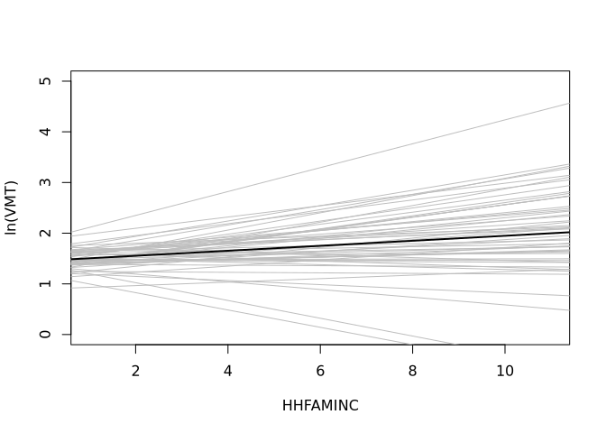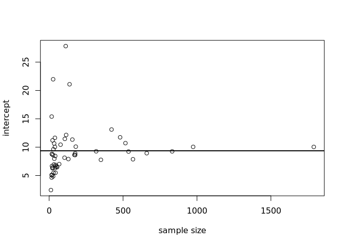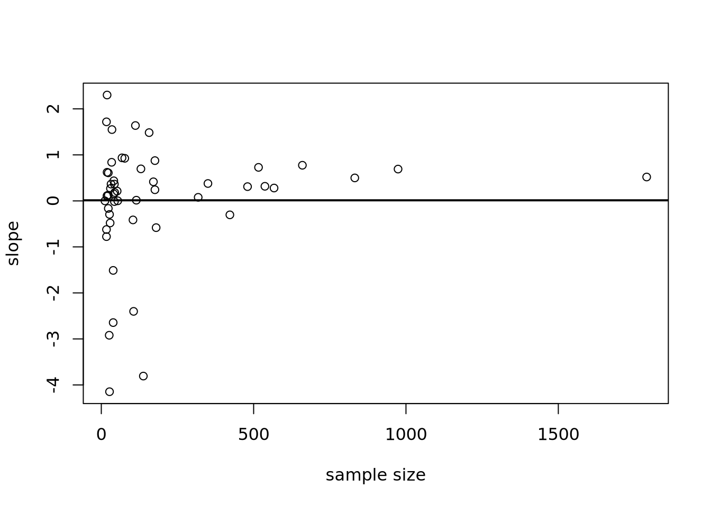


### A hierarchical regression model

\[\mathbf{Y}_{i,j}=\boldsymbol{\beta_j^T x_{i,j}}+\varepsilon_{i,j}=\boldsymbol{\theta^T x_{i,j}+\gamma_j^T x_{i,j}}+\varepsilon_{i,j}\]


\(\boldsymbol{\theta}\sim N_p(\boldsymbol{\mu_0,\Lambda_0})\), 

\(\Sigma\sim Inverse-Wishart(\eta_{0},\boldsymbol{S_0^{-1}})\), 

\(\sigma^2\sim Inverse-Gamma(\frac12\nu_0,\frac12\nu_0\sigma_0^2)\)


### Full conditional distributions

\[
\begin{align} 
\{\boldsymbol{\beta|y_j,X_j,\theta},\sigma^2,\Sigma\}&\sim N_p\left([\Sigma^{-1}+\frac{1}{\sigma^2}\mathbf{X_j'X_j}]^{-1}[\Sigma^{-1}\boldsymbol{\theta}+\frac{1}{\sigma^2}\mathbf{X_j'y_j}],[\Sigma^{-1}+\frac{1}{\sigma^2}\mathbf{X_j'X_j}]^{-1}\right) &&\\ 
\end{align}
\]

\[
\begin{align} 
\{\boldsymbol{\theta|\beta_{1:m}},\Sigma\}&\sim N_p(\boldsymbol{\mu_m,\Lambda_m});\quad \Lambda_m=(\Lambda_0^{-1}+m\Sigma^{-1})^{-1};\quad
\boldsymbol{\mu_m}=\Lambda_m(\Lambda_0^{-1}\boldsymbol{\mu_0}+m\Sigma^{-1}\boldsymbol{\bar\beta}) \\

\{\Sigma|\boldsymbol{\theta,\beta_{1:m}}\}&\sim Inverse-Wishart(\eta_{0}+m,\boldsymbol{[S_0+S_\theta]^{-1}});\quad
\boldsymbol{S_\theta}=\sum_{j=1}^m\boldsymbol{(\beta_j-\theta)(\beta_j-\theta)^T} \\
\sigma^2&\sim Inverse-Gamma(\frac12[\nu_0+\sum n_j],\frac12[\nu_0\sigma_0^2+\text{SSR}]);\quad \text{SSR}=\sum_{j=1}^m\sum_{i=1}^n(y_{i,j}-\boldsymbol{\beta_j^T x_{i,j}})^2 \\ 
\end{align}
\]


### Posterior analysis

#### mvnormal simulation


```r
rmvnorm<-function(n,mu,Sigma)
{ 
  E<-matrix(rnorm(n*length(mu)),n,length(mu))
  t(  t(E%*%chol(Sigma)) +c(mu))
}
```

#### Wishart simulation


```r
rwish<-function(n,nu0,S0)
{
  sS0 <- chol(S0)
  S<-array( dim=c( dim(S0),n ) )
  for(i in 1:n)
  {
     Z <- matrix(rnorm(nu0 * dim(S0)[1]), nu0, dim(S0)[1]) %*% sS0
     S[,,i]<- t(Z)%*%Z
  }
  S[,,1:n]
}
```


#### Setup


```r
p<-dim(X[[1]])[2]
theta<-mu0<-apply(BETA.LS,2,mean)
nu0<-1 ; s2<-s20<-mean(S2.LS)
eta0<-p+2 ; Sigma<-S0<-L0<-cov(BETA.LS) ; BETA<-BETA.LS
THETA.b<-S2.b<-NULL
iL0<-solve(L0) ; iSigma<-solve(Sigma)
Sigma.ps<-matrix(0,p,p)
SIGMA.PS<-NULL
BETA.ps<-BETA*0
BETA.pp<-NULL
set.seed(1)
mu0[2]+c(-1.96,1.96)*sqrt(L0[2,2])
## [1] -2.451  2.477
```

#### MCMC


```r
for(s in 1:10000) {
  ##update beta_j 
  for(j in 1:m) 
  {  
    Vj<-solve( iSigma + t(X[[j]])%*%X[[j]]/s2 )
    Ej<-Vj%*%( iSigma%*%theta + t(X[[j]])%*%Y[[j]]/s2 )
    BETA[j,]<-rmvnorm(1,Ej,Vj) 
  } 
  ##

  ##update theta
  Lm<-  solve( iL0 +  m*iSigma )
  mum<- Lm%*%( iL0%*%mu0 + iSigma%*%apply(BETA,2,sum))
  theta<-t(rmvnorm(1,mum,Lm))
  ##

  ##update Sigma
  mtheta<-matrix(theta,m,p,byrow=TRUE)
  iSigma<-rwish(1, eta0+m, solve( S0+t(BETA-mtheta)%*%(BETA-mtheta) ) )
  ##

  ##update s2
  RSS<-0
  for(j in 1:m) { RSS<-RSS+sum( (Y[[j]]-X[[j]]%*%BETA[j,] )^2 ) }
  s2<-1/rgamma(1,(nu0+sum(N))/2, (nu0*s20+RSS)/2 )
  ##
  ##store results
  if(s%%10==0) 
  { 
   # cat(s,s2,"\n")
    S2.b<-c(S2.b,s2);THETA.b<-rbind(THETA.b,t(theta))
    Sigma.ps<-Sigma.ps+solve(iSigma) ; BETA.ps<-BETA.ps+BETA
    SIGMA.PS<-rbind(SIGMA.PS,c(solve(iSigma)))
    BETA.pp<-rbind(BETA.pp,rmvnorm(1,theta,solve(iSigma)) )
  }
  ##
}
```

#### MCMC diagnostics


```r
library(coda)
effectiveSize(S2.b)
## var1 
## 1099
effectiveSize(THETA.b[,1])
##  var1 
## 829.1
effectiveSize(THETA.b[,2])
##  var1 
## 724.4

apply(SIGMA.PS,2,effectiveSize)
## [1] 747.2 674.0 674.0 724.0

tmp<-NULL;for(j in 1:dim(SIGMA.PS)[2]) { tmp<-c(tmp,acf(SIGMA.PS[,j])$acf[2]) }

acf(S2.b)
acf(THETA.b[,1])
acf(THETA.b[,2])
```

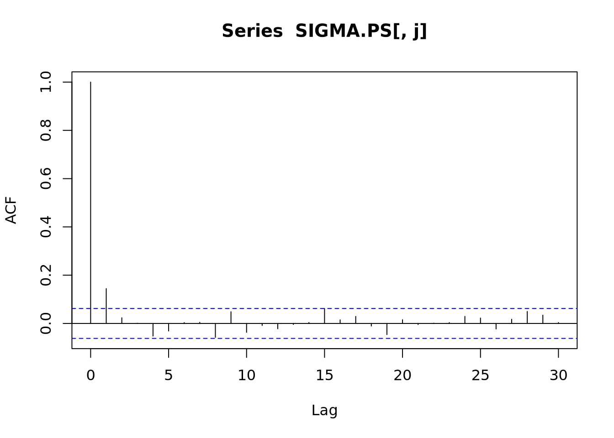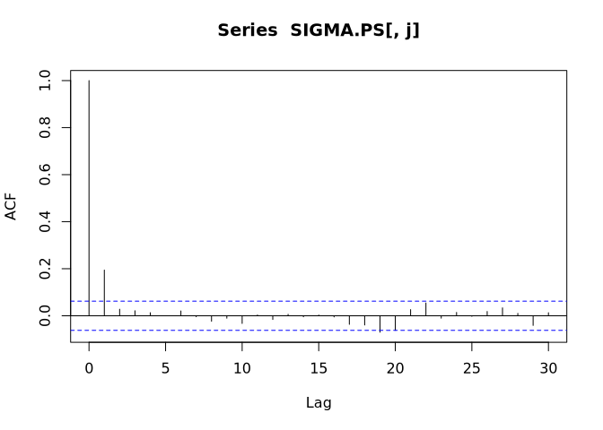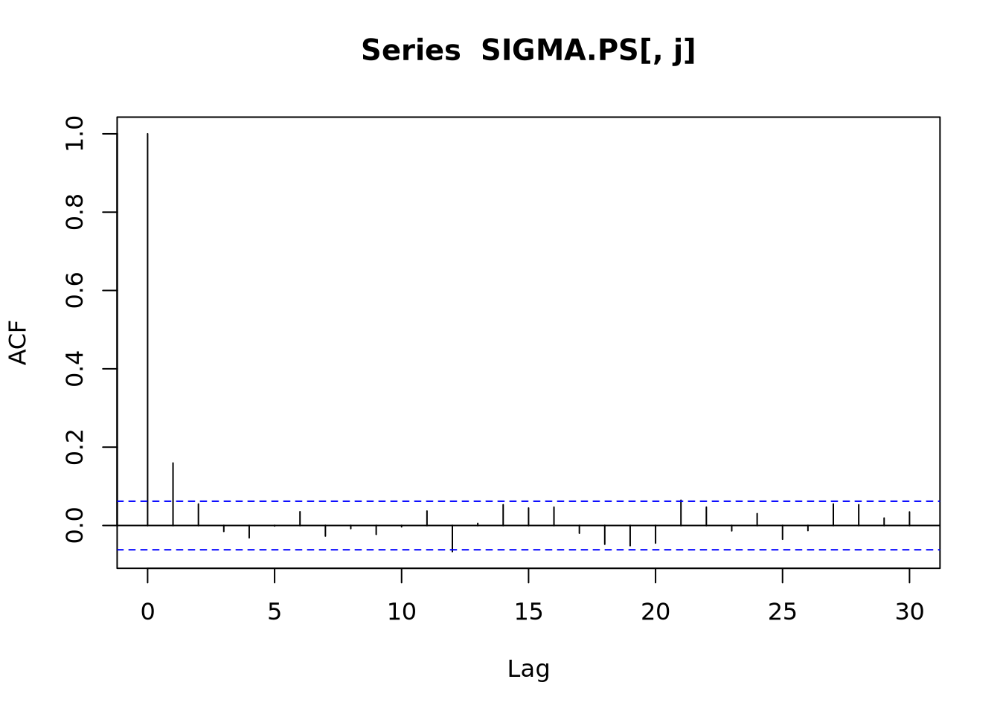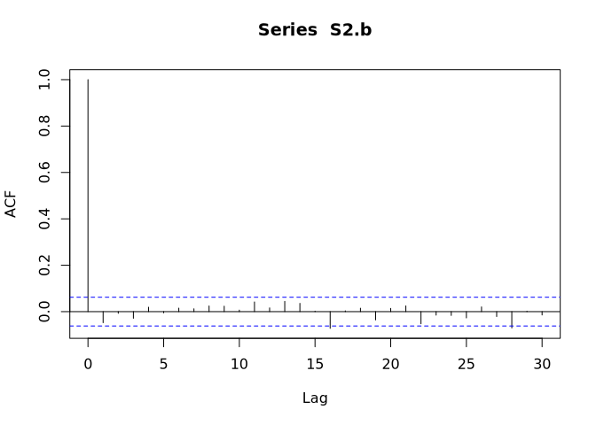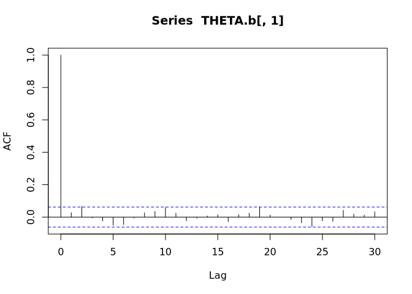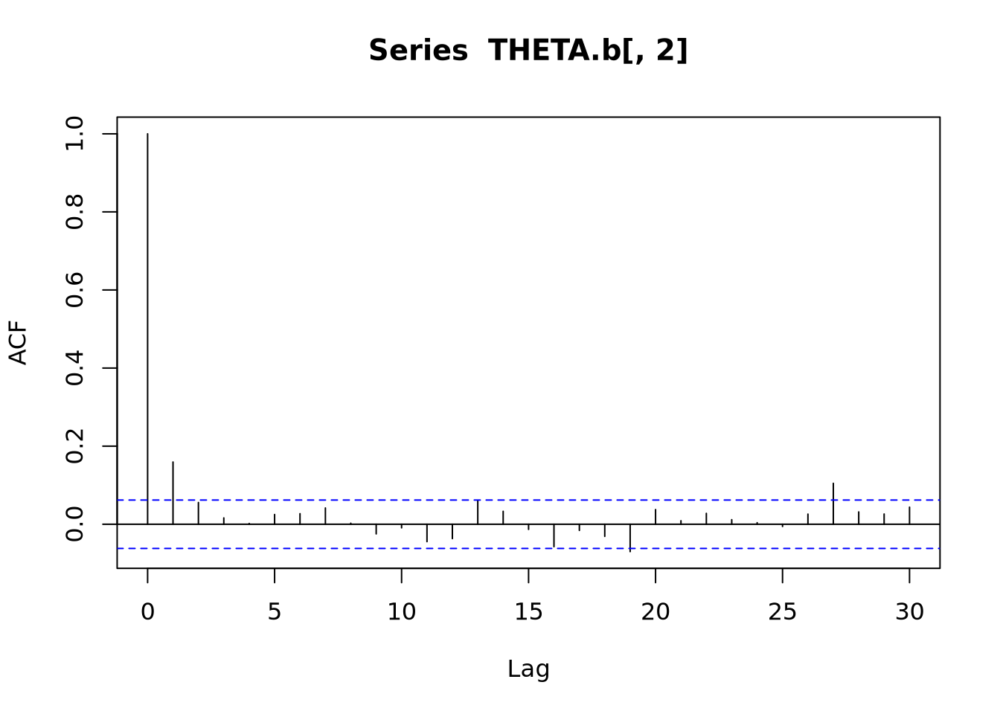


```r
plot(density(THETA.b[,2],adj=2),xlim=range(BETA.pp[,2]), 
      main="",xlab="slope parameter",ylab="posterior density",lwd=2)
lines(density(BETA.pp[,2],adj=2),col="gray",lwd=2)
legend( -3 ,1.0 ,legend=c( expression(theta[2]),expression(tilde(beta)[2])), 
        lwd=c(2,2),col=c("black","gray"),bty="n") 

quantile(THETA.b[,2],prob=c(.025,.5,.975))
##    2.5%     50%   97.5% 
## -0.1237  0.2391  0.5817
mean(BETA.pp[,2]<0) 
## [1] 0.346

BETA.PM<-BETA.ps/1000
plot( range(nhts2017[,4]),c(0,40),type="n",xlab="HHFAMINC", ylab="VMT") # range(nels[,3]),range(nels[,4])
for(j in 1:m) {    abline(BETA.PM[j,1],BETA.PM[j,2],col="gray")  }
abline( mean(THETA.b[,1]),mean(THETA.b[,2]),lwd=2 )
```

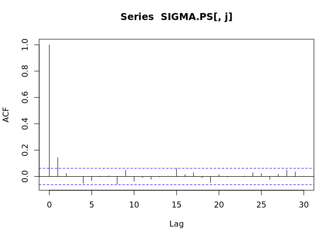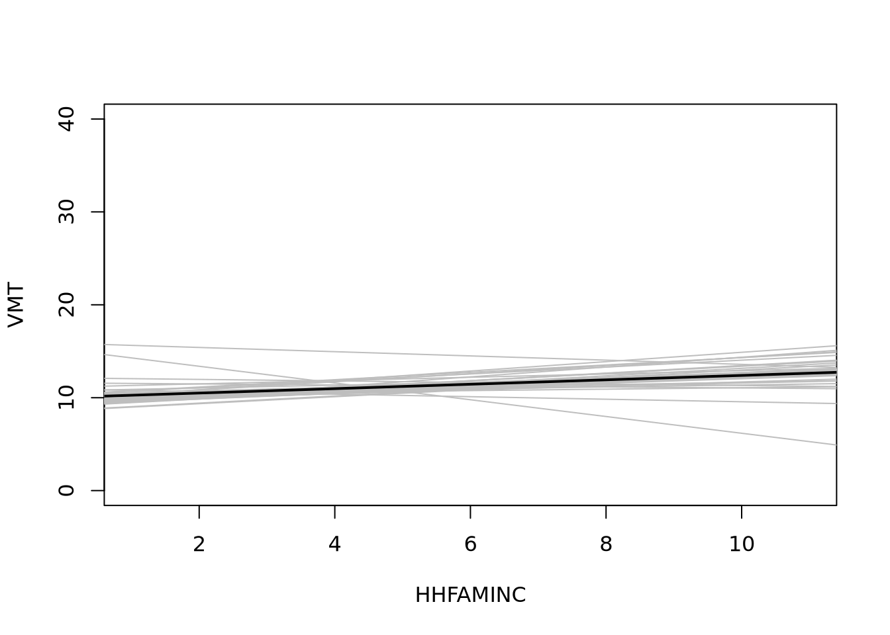


### Generalized linear mixed effects models

- Gibbs steps for \(\boldsymbol{\theta},\Sigma)\)


- Metropolis step for $\boldsymbol{\beta}_j$

- A Metropolis-Hastings approximation algorithm

1. Sample $\boldsymbol{\theta}^{(s+1)}$ from its full conditional distribution.

2. Sample $\Sigma^{(s+1)}$ from its full conditional distribution.

3. For each $j\in\{1,..., m\},$

   a) propose a new value $\beta^\star_j$;
   
   b) set $\beta^{(s+1)}_j$ equal to $\beta^\star_j$ or $\beta^{(s)}_j$ with the appropriate probability.


### Compare with the results using 'brms'


